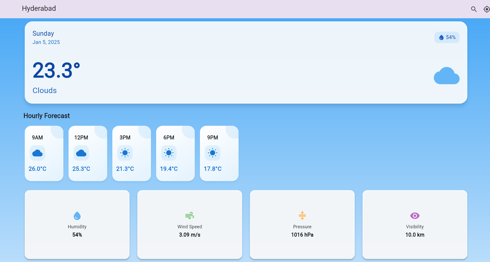
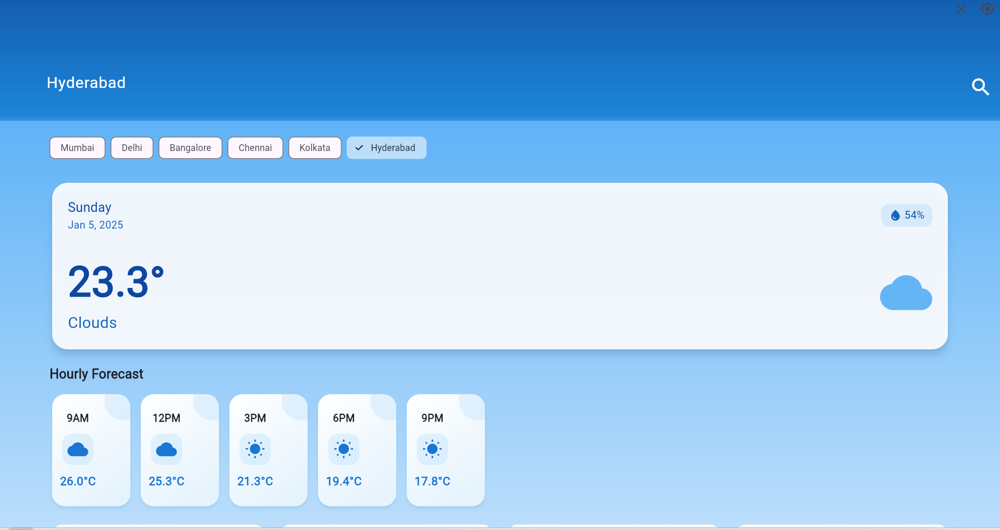
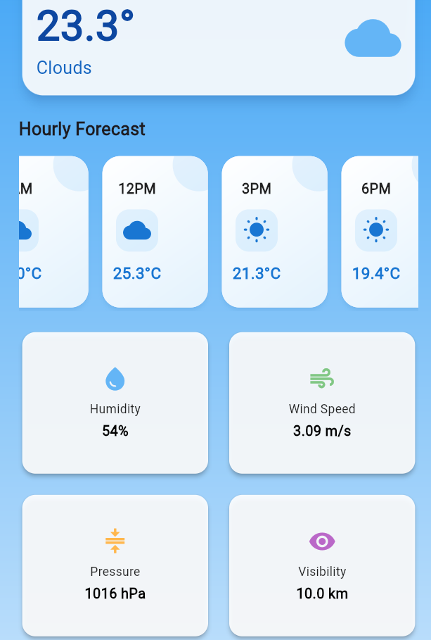

# ☀️ WeatherNow - Real-Time Weather Application

WeatherNow is a sleek and intuitive Flutter application that brings you accurate weather information with a beautiful user interface. Experience weather forecasting with stunning visuals and comprehensive data at your fingertips.

## 🌈 Features That Make WeatherNow Special

WeatherNow transforms complex weather data into an easily digestible format with features that keep you informed and prepared:

- **Real-Time Weather Data**: Get up-to-the-minute weather information powered by the OpenWeatherMap API
- **Location-Based Forecast**: Automatic weather updates based on your current location
- **Comprehensive Weather Details**: Access temperature, humidity, wind speed, and atmospheric pressure
- **Beautiful Weather Icons**: Intuitive weather representation through carefully designed icons
- **Multi-City Support**: Add and track weather in multiple cities
- **Search Functionality**: Easily find weather information for any city worldwide

## 📱 Experience WeatherNow

Take a visual tour through our beautifully designed interface:

<div align="center">
  <table>
    <tr>
      <td align="center"><strong>Home Screen</strong></td>
      <td align="center"><strong>Search Screen</strong></td>
      <td align="center"><strong>Weather Details</strong></td>
    </tr>
    <tr>
      <td></td>
      <td></td>
      <td></td>
    </tr>
  </table>
</div>

## 🛠️ Technical Architecture

WeatherNow is built with modern technologies ensuring reliability and performance:

### Frontend Framework
- **Flutter**: For building natively compiled applications
- **Dart**: Programming language optimized for client development
- **Custom Widgets**: Reusable components for consistent design

### Backend Services
- **OpenWeatherMap API**: For reliable weather data
- **Geolocator**: For precise location tracking
- **HTTP**: For efficient API communication

### Key Dependencies
```yaml
dependencies:
  flutter:
    sdk: flutter
  geolocator: ^10.1.0
  http: ^1.1.0
  intl: ^0.18.1
```

## 🚀 Getting Started

Follow these steps to get WeatherNow running on your device:

1. Clone the repository:
   ```bash
   git clone https://github.com/Raghavendra-Reddy-Padala/weatherapp.git
   ```

2. Navigate to the project directory:
   ```bash
   cd weatherapp
   ```

3. Install dependencies:
   ```bash
   flutter pub get
   ```

4. Add your OpenWeatherMap API key:
   - Go to sec.dart file in lib
   - Add your API key: `WEATHER_API_KEY=your_api_key_here`

5. Run the application:
   ```bash
   flutter run
   ```

## 💡 How to Use WeatherNow

WeatherNow is designed to be intuitive. Here's how to make the most of it:

1. **First Launch**
   - Grant location permissions when prompted
   - View weather details for your current location

2. **Search for Cities**
   - Tap the search icon
   - Enter city name
   - Select from search results

3. **View Weather Details**
   - Tap on any city card
   - View comprehensive weather information
   - Check hourly and daily forecasts

## 🔧 Configuration

Customize WeatherNow by modifying these files:
- `lib/config/api_config.dart`: API endpoints and keys
- `lib/theme/app_theme.dart`: Visual styling
- `lib/utils/constants.dart`: App constants

## 🤝 Contributing

We welcome contributions! Here's how you can help improve WeatherNow:

1. Fork the repository
2. Create your feature branch (`git checkout -b feature/AmazingFeature`)
3. Commit your changes (`git commit -m 'Add some amazing feature'`)
4. Push to the branch (`git push origin feature/AmazingFeature`)
5. Open a Pull Request

## 📈 Future Enhancements

We're constantly working to improve WeatherNow. Coming soon:
- Weather notifications and alerts
- Detailed weather maps
- Historical weather data
- Weather widgets for home screen
- Dark mode support
- Multiple language support

## 📄 License

This project is licensed under the MIT License - see the [LICENSE](LICENSE) file for details.

## 🙏 Acknowledgments

We extend our gratitude to:
- OpenWeatherMap for providing reliable weather data
- Flutter team for the amazing framework
- Our contributors and users for their valuable feedback

---

<p align="center">Made with ❤️ by Raghavendra Reddy Padala</p>

```
Last Updated: January 2025
Version: 1.0.0
```